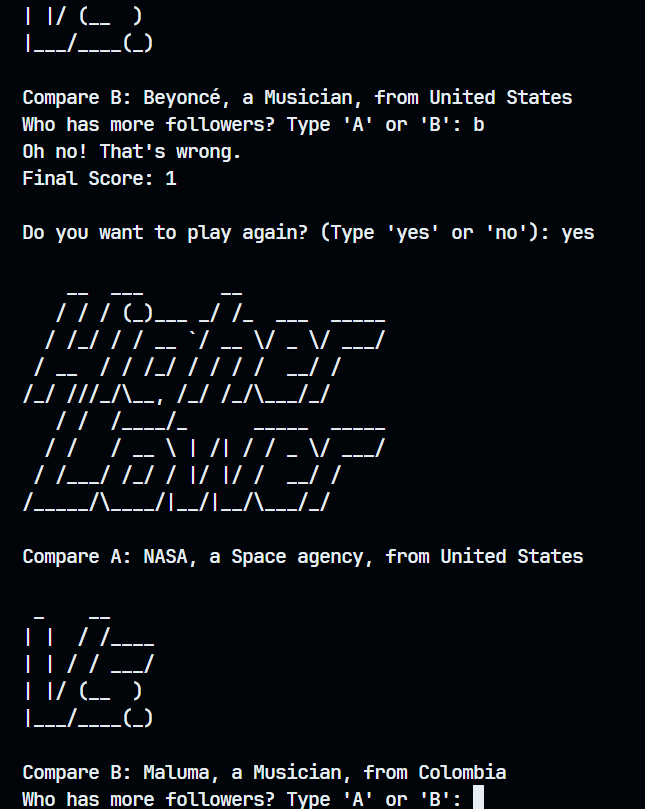

# 🔼 Higher Lower Game

A Python terminal game inspired by the classic **Higher or Lower** concept. The user is shown two celebrities or public figures, and must guess who has more Instagram followers. Get it right? Your score goes up and the game continues. Get it wrong? Game over!



---

## 📌 Features

- Compare follower counts of famous people
- Score tracking that increases with each correct guess
- Random selection of people from a dataset
- Replay option after the game ends
- Clean and modular code with functions

---

## 🚀 Getting Started

### Prerequisites

Make sure you have **Python 3.x** installed on your system.

### Installation

1. Clone the repository:

```bash
git clone https://github.com/csnanx/higher_lower_game.git
cd higher-lower-game
```
